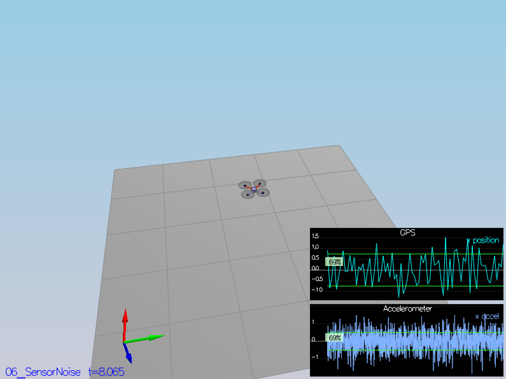
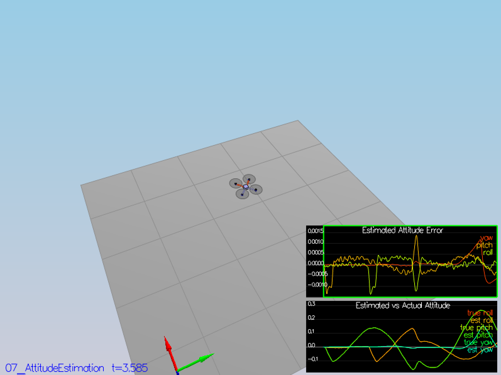
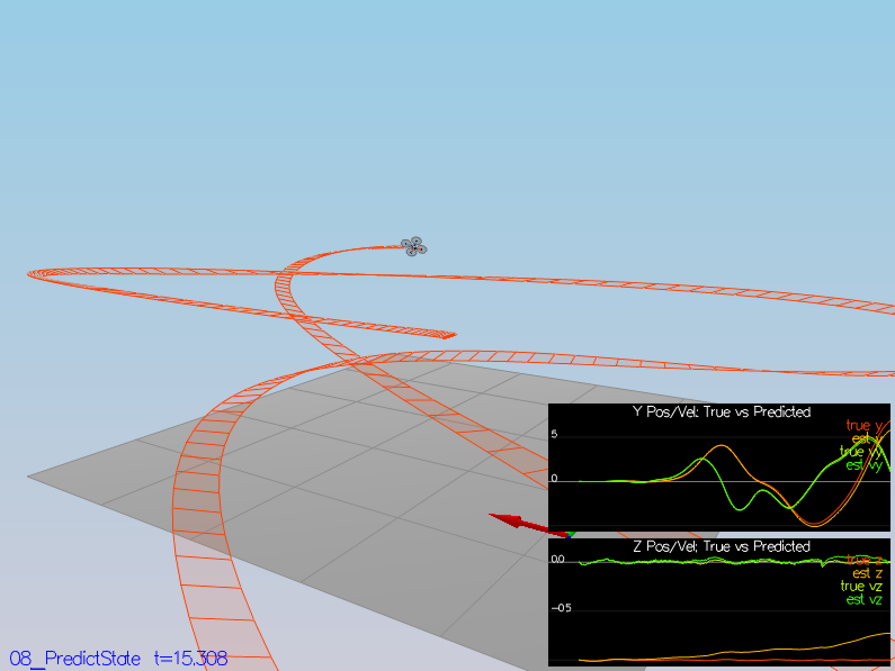
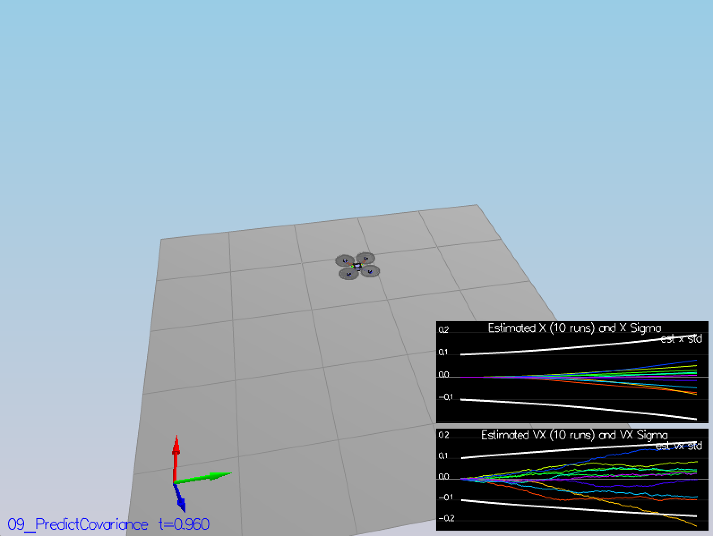
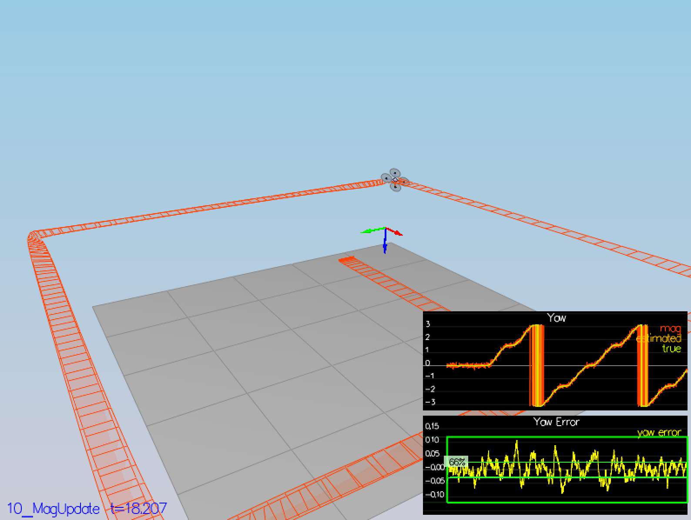
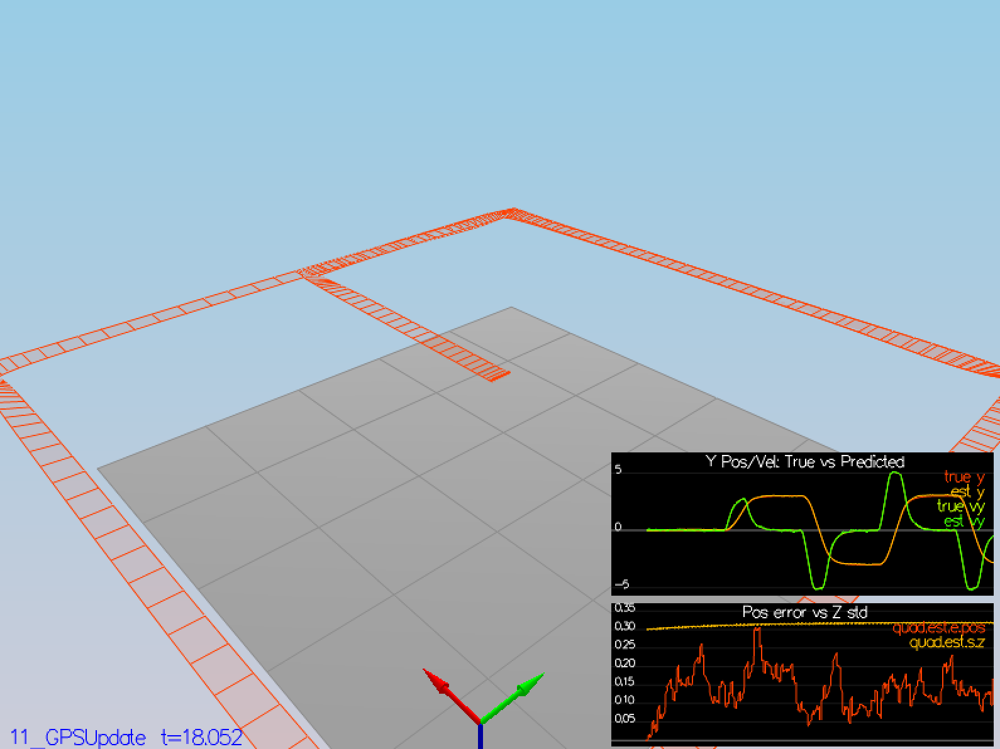

# Project: Building an Estimator
## Write Up

## Step 1 - Sensor Noise
### Scenario 6

### Task

- Your standard deviations should accurately capture the value of approximately 68% of the respective measurements.

### How it was Completed

- EH

```
PASS:
PASS:
```



## Step 2 - Attitude Estimation
### Scenario 7

### Task

- Your attitude estimator needs to get within 0.1 rad for each of the Euler angles for at least 3 seconds.

### How it was Completed

- EH

```
PASS:
```



## Step 3 - Predict State & Covariance
### Scenario 8 & 9 

### Task

- This step doesn't have any specific measurable criteria being checked.

### How it was Completed

- EH

```
PASS:
```




## Step 4 - Magnetometer Update
### Scenario 10

### Task

- Your goal is to both have an estimated standard deviation that accurately captures the error and maintain an error of less than 0.1rad in heading for at least 10 seconds of the simulation.

### How it was Completed

- EH

```
PASS:
PASS:
```



## Step 5 - Closed Loop + GPS Update
### Scenario 11

### Task

- Your objective is to complete the entire simulation cycle with estimated position error of < 1m.

### How it was Completed

- EH

```
PASS:
```



## Step 6 - Adding Your Controller

### Task

- Your objective is to complete the entire simulation cycle with estimated position error of < 1m.

### How it was Completed

- EH

# Building an Estimator Write Up

##UpdateFromIMU

- EH

```
void QuadEstimatorEKF::UpdateFromIMU(V3F accel, V3F gyro)
{
  // Improve a complementary filter-type attitude filter
  // 
  // Currently a small-angle approximation integration method is implemented
  // The integrated (predicted) value is then updated in a complementary filter style with attitude information from accelerometers
  // 
  // Implement a better integration method that uses the current attitude estimate (rollEst, pitchEst and ekfState(6))
  // to integrate the body rates into new Euler angles.
  //
  // HINTS:
  //  - there are several ways to go about this, including:
  //    1) create a rotation matrix based on your current Euler angles, integrate that, convert back to Euler angles
  //    OR 
  //    2) use the Quaternion<float> class, which has a handy FromEuler123_RPY function for creating a quaternion from Euler Roll/PitchYaw
  //       (Quaternion<float> also has a IntegrateBodyRate function, though this uses quaternions, not Euler angles)

  ////////////////////////////// BEGIN STUDENT CODE ///////////////////////////
  // SMALL ANGLE GYRO INTEGRATION:
  // (replace the code below)
  // make sure you comment it out when you add your own code -- otherwise e.g. you might integrate yaw twice

  float predictedPitch = pitchEst + dtIMU * gyro.y;
  float predictedRoll = rollEst + dtIMU * gyro.x;
  ekfState(6) = ekfState(6) + dtIMU * gyro.z;   // yaw

  // normalize yaw to -pi .. pi
  if (ekfState(6) > F_PI) ekfState(6) -= 2.f*F_PI;
  if (ekfState(6) < -F_PI) ekfState(6) += 2.f*F_PI;

  /////////////////////////////// END STUDENT CODE ////////////////////////////

  // CALCULATE UPDATE
  accelRoll = atan2f(accel.y, accel.z);
  accelPitch = atan2f(-accel.x, 9.81f);

  // FUSE INTEGRATION AND UPDATE
  rollEst = attitudeTau / (attitudeTau + dtIMU) * (predictedRoll)+dtIMU / (attitudeTau + dtIMU) * accelRoll;
  pitchEst = attitudeTau / (attitudeTau + dtIMU) * (predictedPitch)+dtIMU / (attitudeTau + dtIMU) * accelPitch;

  lastGyro = gyro;
}
```

##PredictState

- EH

```
VectorXf QuadEstimatorEKF::PredictState(VectorXf curState, float dt, V3F accel, V3F gyro)
{
  assert(curState.size() == QUAD_EKF_NUM_STATES);
  VectorXf predictedState = curState;
  // Predict the current state forward by time dt using current accelerations and body rates as input
  // INPUTS: 
  //   curState: starting state
  //   dt: time step to predict forward by [s]
  //   accel: acceleration of the vehicle, in body frame, *not including gravity* [m/s2]
  //   gyro: body rates of the vehicle, in body frame [rad/s]
  //   
  // OUTPUT:
  //   return the predicted state as a vector

  // HINTS 
  // - dt is the time duration for which you should predict. It will be very short (on the order of 1ms)
  //   so simplistic integration methods are fine here
  // - we've created an Attitude Quaternion for you from the current state. Use 
  //   attitude.Rotate_BtoI(<V3F>) to rotate a vector from body frame to inertial frame
  // - the yaw integral is already done in the IMU update. Be sure not to integrate it again here

  Quaternion<float> attitude = Quaternion<float>::FromEuler123_RPY(rollEst, pitchEst, curState(6));

  ////////////////////////////// BEGIN STUDENT CODE ///////////////////////////


  /////////////////////////////// END STUDENT CODE ////////////////////////////

  return predictedState;
}
```

##GetRbgPrime

- EH

```
MatrixXf QuadEstimatorEKF::GetRbgPrime(float roll, float pitch, float yaw)
{
  // first, figure out the Rbg_prime
  MatrixXf RbgPrime(3, 3);
  RbgPrime.setZero();

  // Return the partial derivative of the Rbg rotation matrix with respect to yaw. We call this RbgPrime.
  // INPUTS: 
  //   roll, pitch, yaw: Euler angles at which to calculate RbgPrime
  //   
  // OUTPUT:
  //   return the 3x3 matrix representing the partial derivative at the given point

  // HINTS
  // - this is just a matter of putting the right sin() and cos() functions in the right place.
  //   make sure you write clear code and triple-check your math
  // - You can also do some numerical partial derivatives in a unit test scheme to check 
  //   that your calculations are reasonable

  ////////////////////////////// BEGIN STUDENT CODE ///////////////////////////


  /////////////////////////////// END STUDENT CODE ////////////////////////////

  return RbgPrime;
}
```

##Predict

- EH

```
void QuadEstimatorEKF::Predict(float dt, V3F accel, V3F gyro)
{
  // predict the state forward
  VectorXf newState = PredictState(ekfState, dt, accel, gyro);

  // Predict the current covariance forward by dt using the current accelerations and body rates as input.
  // INPUTS: 
  //   dt: time step to predict forward by [s]
  //   accel: acceleration of the vehicle, in body frame, *not including gravity* [m/s2]
  //   gyro: body rates of the vehicle, in body frame [rad/s]
  //   state (member variable): current state (state at the beginning of this prediction)
  //   
  // OUTPUT:
  //   update the member variable cov to the predicted covariance

  // HINTS
  // - update the covariance matrix cov according to the EKF equation.
  // 
  // - you may find the current estimated attitude in variables rollEst, pitchEst, state(6).
  //
  // - use the class MatrixXf for matrices. To create a 3x5 matrix A, use MatrixXf A(3,5).
  //
  // - the transition model covariance, Q, is loaded up from a parameter file in member variable Q
  // 
  // - This is unfortunately a messy step. Try to split this up into clear, manageable steps:
  //   1) Calculate the necessary helper matrices, building up the transition jacobian
  //   2) Once all the matrices are there, write the equation to update cov.
  //
  // - if you want to transpose a matrix in-place, use A.transposeInPlace(), not A = A.transpose()
  // 

  // we'll want the partial derivative of the Rbg matrix
  MatrixXf RbgPrime = GetRbgPrime(rollEst, pitchEst, ekfState(6));

  // we've created an empty Jacobian for you, currently simply set to identity
  MatrixXf gPrime(QUAD_EKF_NUM_STATES, QUAD_EKF_NUM_STATES);
  gPrime.setIdentity();

  ////////////////////////////// BEGIN STUDENT CODE ///////////////////////////


  /////////////////////////////// END STUDENT CODE ////////////////////////////

  ekfState = newState;
}
```

##UpdateFromGPS

- EH

```
void QuadEstimatorEKF::UpdateFromGPS(V3F pos, V3F vel)
{
  VectorXf z(6), zFromX(6);
  z(0) = pos.x;
  z(1) = pos.y;
  z(2) = pos.z;
  z(3) = vel.x;
  z(4) = vel.y;
  z(5) = vel.z;

  MatrixXf hPrime(6, QUAD_EKF_NUM_STATES);
  hPrime.setZero();

  // GPS UPDATE
  // Hints: 
  //  - The GPS measurement covariance is available in member variable R_GPS
  //  - this is a very simple update
  ////////////////////////////// BEGIN STUDENT CODE ///////////////////////////

  /////////////////////////////// END STUDENT CODE ////////////////////////////

  Update(z, hPrime, R_GPS, zFromX);
}
```

##UpdateFromMag

- EH

```
void QuadEstimatorEKF::UpdateFromMag(float magYaw)
{
  VectorXf z(1), zFromX(1);
  z(0) = magYaw;

  MatrixXf hPrime(1, QUAD_EKF_NUM_STATES);
  hPrime.setZero();

  // MAGNETOMETER UPDATE
  // Hints: 
  //  - Your current estimated yaw can be found in the state vector: ekfState(6)
  //  - Make sure to normalize the difference between your measured and estimated yaw
  //    (you don't want to update your yaw the long way around the circle)
  //  - The magnetomer measurement covariance is available in member variable R_Mag
  ////////////////////////////// BEGIN STUDENT CODE ///////////////////////////


  /////////////////////////////// END STUDENT CODE ////////////////////////////

  Update(z, hPrime, R_Mag, zFromX);
}
```
